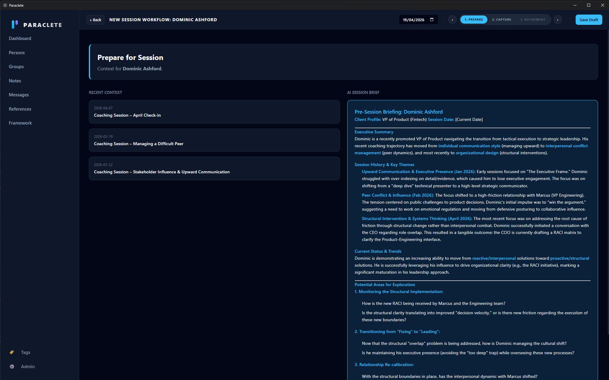
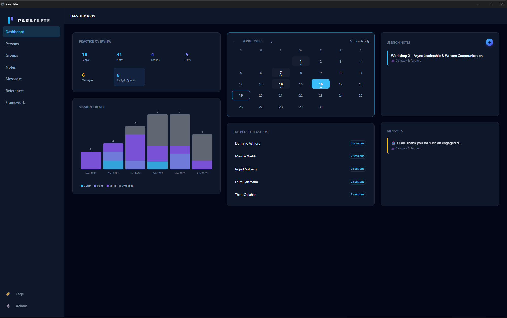
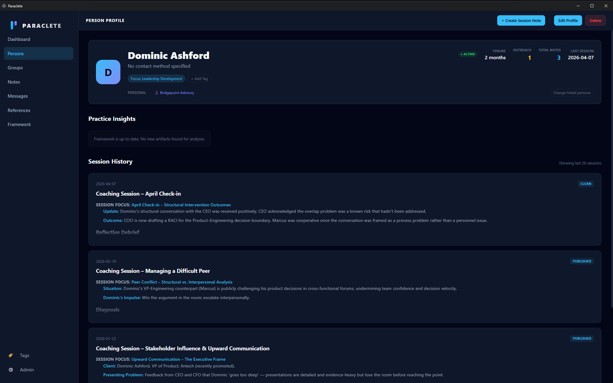
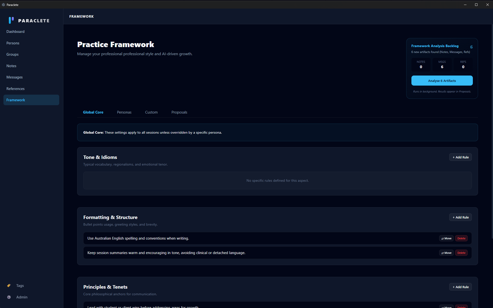
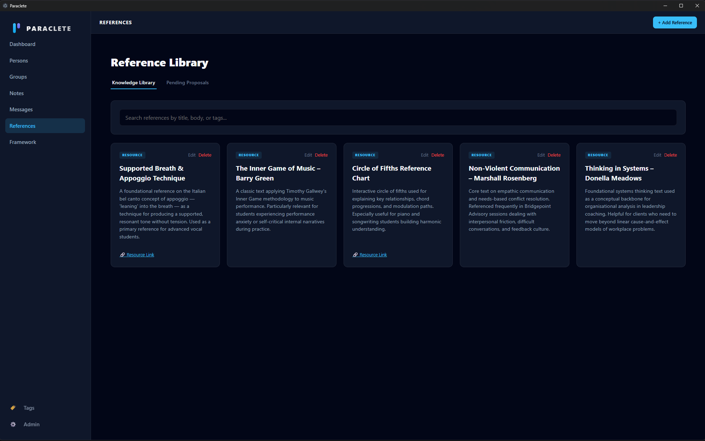
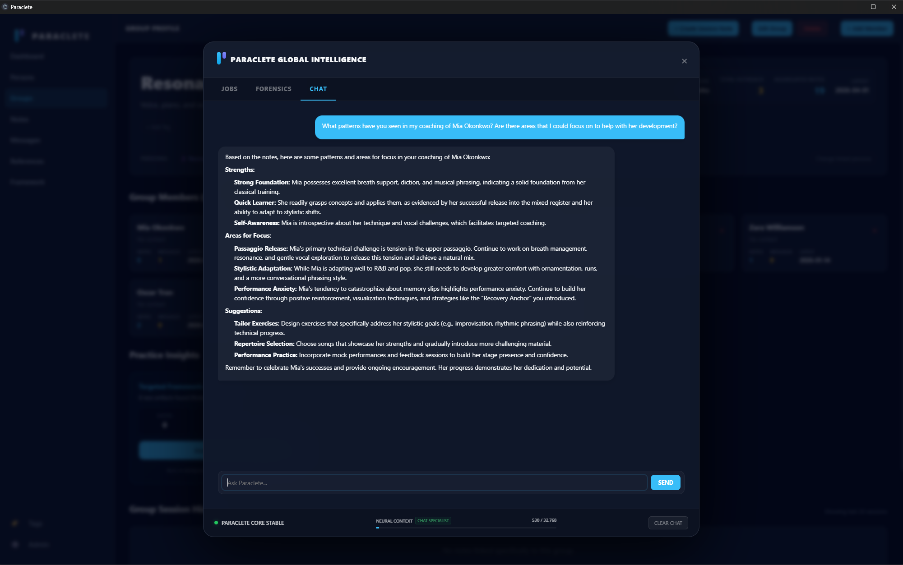
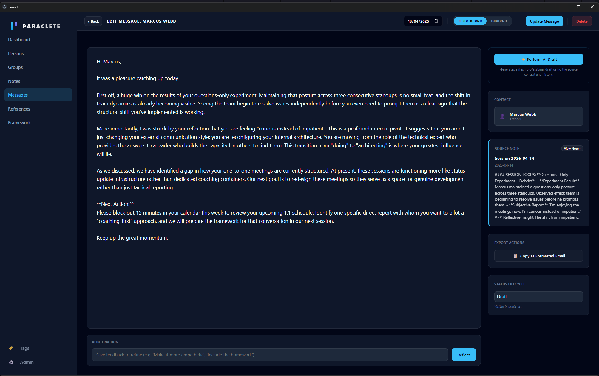

# Paraclete

> **Paraclete** is a personal practice OS for 1-1 service providers — coaches, tutors, consultants, and teachers. It is a privacy-first, local-first workstation designed to augment human relationships with intelligent, locally-hosted AI.

> [!NOTE]
> **Work In Progress**: Paraclete is currently under active development. We are sharing it early and openly so that people can use it, provide feedback, and build upon its foundation.

---

## 🌟 Vision & Philosophy
Paraclete (from the Greek *parakletos*, "one called alongside to help") acts as the digital infrastructure for practitioners. It handles the administrative heavy lifting—preparing for sessions, capturing notes, cleaning transcriptions, and drafting follow-ups—so you can focus entirely on the human in front of you.

**Scaling WITHOUT Losing Identity**: The core challenge for high-impact service providers is scaling their unique expertise without becoming a "template-driven" bot. Paraclete is designed to scale your *specific* practice framework. By codifying your tone, principles, and professional tenets into a local AI context, the system augments your capacity while ensuring every output remains authentically *yours*.

**Our Core Tenets:**
- **Local-First & Complete Privacy:** Your practice is inherently private. There is no cloud sync, no tracking telemetry, and no external API calls to remote AI providers. Everything stays on your machine.
- **Open Ownership:** You completely own your data. The entire database, including all your notes, can be exported and imported transparently as plain JSON whenever you wish. 
- **Augmentation, Not Replacement:** AI should help you prepare and reflect, never replace the genuine human connection.

## ✨ Core Features
- **Practice Dashboard & Analytics**: A deterministic overview of your practice. Visualise session frequency via the Note Calendar, track developmental trends, and monitor Reference utilisation.
- **The Note Lifecycle**: A structured workflow derived from clinical and coaching best practices: `Prepare → Capture → Clean → Publish → Archive`.
- **Person & Group Management**: Deep tracking of individuals and cohorts, including session history and personalised knowledge mapping.
- **Full Data Exportability**: True ownership means easy ejection. Export notes, profiles, and historical chat data into a universal JSON format at any time.
- **Reference Library**: Accumulate your intellectual capital. Extract concepts, resources, and patterns from sessions into a reusable knowledge base.
- **Universal Tagging**: A strictly managed global tagging system that connects people, notes, and references through shared vocabulary.
- **Local AI Context (Gemma 4 MoE)**: 100% private inference using `llama.cpp` and CUDA acceleration. Leverage local reasoning capabilities to intelligently clean dictation and extract entity relationships.

## 🖼️ The Practitioner's Journey

Paraclete is built around the "Practice Lifecycle"—a continuous loop of preparation, interaction, and reflection.

### 1. Preparation & Context
Before every session, Paraclete synthesises historical notes, ongoing trends, and previous outcomes into a deterministic **AI Session Brief**. This allows you to walk into a 1-1 conversation with a high-fidelity "secondary brain" that remembers exactly where you left off.



### 2. Practice Analytics & Dashboard
The **Dashboard** provides a bird's-eye view of your entire workstation. Monitor session trends, track outreach velocity, and manage the background analysis queue to keep your practice insights sharp and up-to-date.



### 3. Deep Person & Group Context
Each **Person Profile** acts as a living dossier. View every session note, reflective debrief, and practice insight in one high-density interface, grouped by logical stages of their development.



### 4. Your Practice Framework
This is the heart of Paraclete. The **Practice Framework** allows you to codify your unique professional "vibe." Define your tone, formatting rules, and core principles. Local AI uses this framework to ensure that every summary or draft follow-up feels like it was written by you, not a generic model.



### 5. Intellectual Capital: The Reference Library
Extract and store your own mental models, frameworks, and resources. The **Reference Library** connects your intellectual capital to your active notes, creating a cross-linked web of knowledge that grows with every session.



### 6. Reflective Intelligence
Use the **Paraclete Global Intelligence** chat to ask complex questions across your entire practice. *"What patterns have I seen in my coaching with Mia?"* or *"Summarise the technical hurdles faced by my enterprise cohort."* The AI answers using your local context only.



### 7. Professional Outreach
Drafting high-quality follow-up messages takes hours. Paraclete's **Message Creator** leverages your source notes and practice framework to generate authentic, professional drafts that can be copied directly into your email or messaging client.




## 🛠️ Tech Stack
- **Container**: Electron (Desktop focus, Windows primary)
- **Frontend**: React 18, TypeScript, Vanilla CSS (Premium Aesthetic)
- **Backend API**: FastAPI (Python 3.12)
- **Database**: SQLite with SQLAlchemy & Alembic migrations
- **Inference**: `llama-cpp-python` with CUDA support for Gemma 4 MoE
- **Build System**: `electron-vite`

---

## 📁 Project Structure
- `/src`: Electron main, preload, and React renderer source code.
  - `/main`: Main process, including `BackendManager` for Python lifecycle.
  - `/renderer`: React application, components, and assets.
- `/backend`: FastAPI source code, SQLite models, and AI processing.
  - `main.py`: API entry point.
  - `models.py`: SQLAlchemy database models.
  - `schemas.py`: Pydantic validation schemas.
- `/design`: Product Requirements (PRD), Technical Designs (TDD), and Implementation Plans.
- `/scripts`: Setup and utility scripts (PowerShell).

---

## 🚀 Getting Started

### 1. Prerequisites
- **Node.js** (v20+)
- **Windows** (Primary target)
- **NVIDIA GPU** (Optional but recommended for CUDA-accelerated AI)

### 2. Initial Setup
Clone the repository and install the Node dependencies:
```powershell
npm install
```

### 3. Python Environment Setup
Paraclete manages its own standalone Python environment. You can initialise it manually using the provided script:
```powershell
./scripts/setup_env.ps1 -installPath "$env:APPDATA/paraclete-app/python_env"
```
*Note: This script downloads a portable Python, installs `llama-cpp-python` with CUDA flags, and prepares the model directory.*

### 4. Running in Development
Start the Electron application and the Vite dev server:
```powershell
npm run dev
```
The application will automatically spawn the FastAPI backend as a child process.

---

## 🏗️ Build & Distribution

### Windows Build
To package the application for distribution:
```powershell
npm run build:win
```
This will compile the frontend, bundle the backend files, and generate an installer in the `/dist` directory.

---

## 🛡️ Privacy & Security
Paraclete is built on a **local-first** philosophy. Your notes, client data, and AI processing never leave your machine unless you explicitly choose to export them. There is no cloud sync, no tracking, and no external AI provider logs.

## 📝 Licence

This project is licenced under the **MIT Licence**.

### Usage Policy
The MIT Licence is a permissive free software licence that places very few restrictions on reuse. Under this licence, you are free to:
- **Commercially use** the application in your own practice.
- **Modify** the codebase to suit your specific needs or add new features.
- **Distribute** compiled versions or forks of this project.
- **Privately use** the software without sharing your modifications.

**Condition:** You must include the original copyright and permission notice in any substantial copying or distribution of this software. The software is provided "as is", without warranty of any kind.

### Stack & Model Compatibility
All core libraries and frameworks used in Paraclete are fully compatible with this permissive open-source model:
- **Frontend & Tooling** (React, Vite, Electron, Node.js) are distributed under the MIT licence.
- **Backend Infrastructure** (FastAPI, SQLAlchemy, Alembic, SQLite) are distributed under MIT or Public Domain licences.
- **Inference Engine** (`llama.cpp` and `llama-cpp-python`) are MIT licenced.
- **AI Models (Gemma 4 MoE):** Both the project code and the **Gemma 4 model weights** are released under open-source licences. Specifically, Google released the Gemma 4 family under the highly permissive **Apache 2.0 licence**. This means the model weights and architecture can be used commercially, modified, and redistributed freely without restrictive barriers, making Paraclete's local-first, privacy-focused architecture 100% compatible with an unrestricted deployment model.
